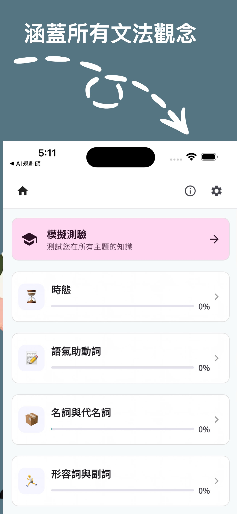
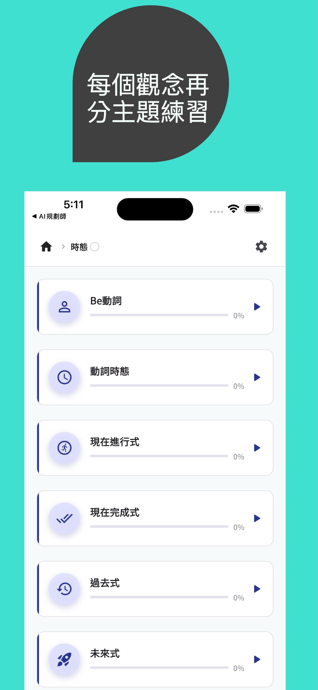
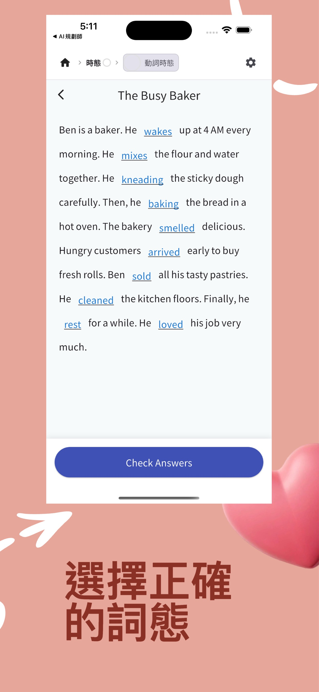

# Grammar Tutor — Handy Grammar

A Flutter app for practicing English grammar on the go. Designed for convenient single-handed operation with 33 topics and 1,500+ quiz questions.


## Features

- **33 grammar topics** organized into 6 categories
- **1,500+ multiple-choice quiz questions** with instant feedback and explanations
- **Mock test mode** — randomized exams drawn from all topics with configurable question count and score history
- **Progress tracking** across individual topics
- **Light and dark themes**
- **Multilingual UI** — English, Traditional Chinese (繁體中文), Simplified Chinese (简体中文)

## Grammar Topics

| Category | Topics |
|---|---|
| **Tenses** | Be Verbs, Verb Tenses, Present Continuous, Present Perfect, Past Tenses, Future Tenses, Imperative, Subjunctive, Passive Voice |
| **Modals** | Modal Verbs |
| **Nouns & Pronouns** | Singular/Plural, Countable/Uncountable, Pronouns, Other Pronouns, Possessives, Articles (A/An/The), Determiners |
| **Adjectives & Adverbs** | Adjectives, Adjective Order, Comparisons, Construction Patterns, Adverbs |
| **Sentence Structure** | Questions, Tag Questions, Negatives, Conditionals, Relative Clauses, Conjunctions, Transitive/Intransitive Verbs |
| **Prepositions** | Prepositions, Phrasal Verbs, Gerunds & Infinitives |

## Screenshots

<p float="left">
  
  
  
</p>

## Getting Started

### Prerequisites

- Flutter SDK `^3.10.3`
- Dart SDK `^3.10.3`
- Xcode (iOS) or Android Studio (Android)

### Run locally

```bash
flutter pub get
flutter run
```

### Build

```bash
# iOS
flutter build ios --release

# Android
flutter build apk --release
```

See [docs/release_build.md](docs/release_build.md) for full release instructions.

## Tech Stack

- **Flutter** + **Dart**
- **go_router** — navigation
- **provider** — state management
- **shared_preferences** — local persistence
- **google_fonts** / **NotoSansTC** — typography
- **flutter_localizations** — i18n (en, zh-TW, zh-CN)

## Privacy & Support

- [Privacy Policy](docs/handy_grammar_privacy_policy.html)
- [Support](docs/handy_grammar_support.html)
